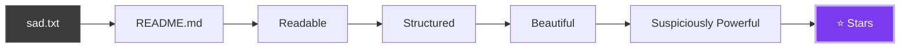
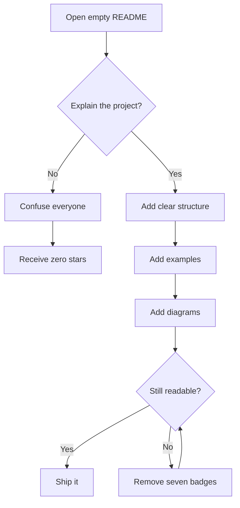
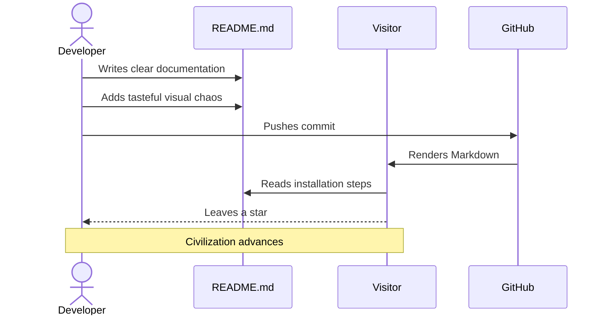
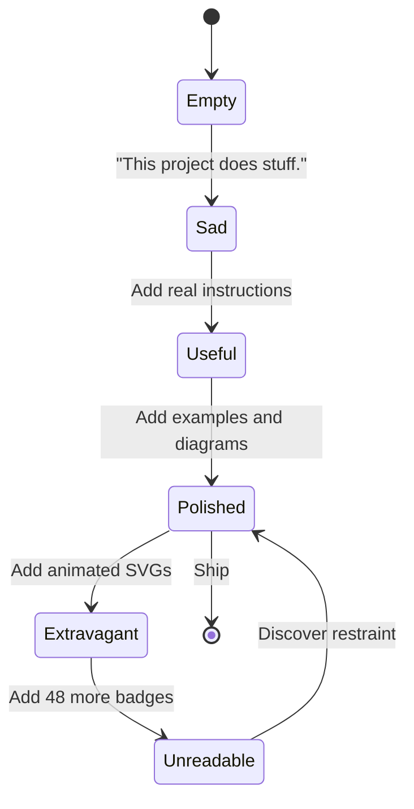

<!--
╔══════════════════════════════════════════════════════════════════════════════╗
║                         YOU FOUND THE SOURCE CODE                            ║
║                                                                              ║
║  Congratulations. You have unlocked the secret Markdown developer ending.   ║
║  Achievement: "Viewed Raw Instead of Pretending to Understand the README"    ║
╚══════════════════════════════════════════════════════════════════════════════╝
-->

<div align="center">

<a href="https://www.markdownguide.org/">
  
</a>

<a href="https://readme-typing-svg.demolab.com/demo/">
  
</a>

<br />

<a href="https://www.markdownguide.org/"></a>
<a href="https://github.github.com/gfm/"></a>
<a href="#-the-chaos-index"></a>
<a href="#-final-boss"></a>
<a href="#-the-checklist-of-destiny"></a>

<br />

<h3>🚨 This is not a README.</h3>

<h3>This is a <strong>hostile takeover of plain text</strong>.</h3>

<sub>Built with Markdown, HTML fragments, questionable restraint, and absolutely no JavaScript.</sub>

<br /><br />

<a href="#-level-01-text-with-attitude"><strong>⚡ Start the tutorial</strong></a>
&nbsp;•&nbsp;
<a href="#-level-08-code-block-alchemy"><strong>🧪 Open the laboratory</strong></a>
&nbsp;•&nbsp;
<a href="#-level-12-mermaid-summoning-circle"><strong>🗺️ View the power map</strong></a>
&nbsp;•&nbsp;
<a href="#-final-boss"><strong>👑 Fight the final boss</strong></a>

</div>

---

> [!CAUTION]
> **Plain text has been detected.**  
> Remain calm. Put down the `.docx`. Step away from the formatting toolbar.

> [!IMPORTANT]
> Your `README.md` is often the first thing people inspect.  
> It should explain the project clearly—but clarity is allowed to arrive wearing sunglasses.

---

## 📡 Transmission from the Markdown Dimension

> _“I’ll just write plain text,”_ you said.
>
> **Incorrect.**
>
> Welcome to **GitHub Flavored Markdown**, where:
>
> - `#` becomes architecture,
> - `>` becomes authority,
> - backticks become credibility,
> - and three suspiciously placed hyphens become a horizontal empire.

```txt
BEFORE: This project does stuff.

AFTER:  A navigable, illustrated, collapsible,
        syntax-highlighted documentation experience.
```

<p align="center">
  <strong>Your repository is already being judged.</strong>
  <br />
  <code>README.md</code> is your opening argument.
</p>

---

## 🧭 Navigation Matrix

| Sector | Capability | Teleport |
| :---: | --- | :---: |
| `01` | Text styling | [Enter](#-level-01-text-with-attitude) |
| `02` | Lists and nesting | [Enter](#-level-02-list-based-domination) |
| `03` | Tables | [Enter](#-level-03-table-technology) |
| `04` | Task lists | [Enter](#-level-04-the-checklist-of-destiny) |
| `05` | Headers | [Enter](#-level-05-header-hierarchy) |
| `06` | Quotes and alerts | [Enter](#-level-06-quotation-fortress) |
| `07` | Keyboard keys and small text | [Enter](#-level-07-tiny-text-big-ego) |
| `08` | Code blocks and diffs | [Enter](#-level-08-code-block-alchemy) |
| `09` | Links and images | [Enter](#-level-09-hyperlink-hyperspace) |
| `10` | Collapsible content | [Enter](#-level-10-collapsible-secret-chambers) |
| `11` | Mathematics | [Enter](#-level-11-mathematical-superiority) |
| `12` | Mermaid diagrams | [Enter](#-level-12-mermaid-summoning-circle) |
| `13` | Footnotes and hidden comments | [Enter](#-level-13-forbidden-knowledge) |
| `∞` | Final boss | [Enter](#-final-boss) |

---

# 🧬 MARKDOWN: THE FULL EVOLUTION



---

## 🎭 LEVEL 01: TEXT WITH ATTITUDE

Markdown gives ordinary words several increasingly dramatic forms.

| Source | Rendered intention | Threat level |
| --- | --- | :---: |
| `*italic*` | _Subtle emphasis_ | 🟢 |
| `**bold**` | **Important emphasis** | 🟡 |
| `***bold italic***` | ***Maximum emphasis*** | 🟠 |
| `` `inline code` `` | `Technical credibility` | 🔵 |
| `~~deleted~~` | ~~Evidence removal~~ | 🔴 |
| `<sub>small</sub>` | <sub>whispering</sub> | 🤫 |
| `<sup>high</sup>` | <sup>ascending</sup> | 🚀 |
| `<ins>inserted</ins>` | <ins>newly important</ins> | ✨ |

### Formatting combo attack

**Bold text containing _italic text containing `inline code`_ while remaining bold.**

~~This sentence was removed for being insufficiently dramatic.~~

<ins>This sentence was added after the README gained self-awareness.</ins>

> [!TIP]
> Use emphasis to create hierarchy—not to make every sentence fight for the throne.

---

## 🪆 LEVEL 02: LIST-BASED DOMINATION

- Normal point
- **Strong point**
- `Inline code point`
- [Hyperlinked flex](https://www.markdownguide.org/)
  - Nested idea
    - Deeper context
      - Suspiciously deep sub-point
        - We have entered the list mines
          - **Send indentation**

### Ordered chaos

1. Write the README.
2. Add useful structure.
3. Add tasteful decoration.
4. Ignore the word “tasteful.”
5. Add an animated banner.
6. Achieve documentation transcendence.

### Mixed-species list

1. **Project setup**
   - Create `README.md`
   - Add a title
   - Explain the project
2. **Visual escalation**
   - Add badges
   - Add diagrams
   - Add collapsible sections
3. **Final verification**
   - Preview on GitHub
   - Test every link
   - Pretend this was always the plan

---

## 🧱 LEVEL 03: TABLE TECHNOLOGY

| Syntax | Ability unlocked | Power | Recommended usage |
| :---: | --- | :---: | --- |
| `*text*` | _Italics_ | 🧍 | Gentle emphasis |
| `**text**` | **Bold** | 💪 | Important concepts |
| `***text***` | ***Galaxy brain*** | 🧠 | Controlled drama |
| `` `code` `` | `Monospace` | 🧪 | Commands and identifiers |
| `~~text~~` | ~~Strikethrough~~ | 🗡️ | Corrections and jokes |
| `[text](url)` | Teleportation | 🌀 | Useful destinations |
| `` | Image summoning | 🖼️ | Screenshots and art |

| README State | Stars | Aura |
| :--- | :---: | :---: |
| `This project does stuff.` | `0` | 🪦 |
| Clear documentation | `+10` | 📘 |
| Clear documentation with diagrams | `+100` | 🧠 |
| Clear documentation with animated SVGs | `OVER 9000` | ⚡ |

---

## ✅ LEVEL 04: THE CHECKLIST OF DESTINY

- [x] Admit Markdown is useful
- [x] Stop treating documentation as an afterthought
- [x] Learn GitHub Flavored Markdown
- [x] Discover task lists
- [ ] Use formatting responsibly
- [ ] Resist adding seventeen more badges
- [ ] Fail to resist
  - [x] Add seventeen more badges
  - [ ] Experience regret
    - [ ] Regret not found

```diff
+ Added Markdown skills
+ Added visual hierarchy
+ Added actual documentation
- Removed excuses
- Removed "I'll write it later"
- Removed one tragic README
```

---

## 🏛️ LEVEL 05: HEADER HIERARCHY

# Header 1 — The Emperor

## Header 2 — The Chancellor

### Header 3 — The Strategist

#### Header 4 — The Specialist

##### Header 5 — The Intern with Production Access

###### Header 6 — The Fine Print Nobody Read

> [!NOTE]
> Headers are not merely bigger text. They define document structure, navigation, and automatically generated anchors.

---

## 🗣️ LEVEL 06: QUOTATION FORTRESS

> “Markdown is just plain text,” they whispered.
>
> > “Then why does it have tables?” asked the apprentice.
> >
> > > “And diagrams?” asked the architect.
> > >
> > > > “And mathematical notation?” asked the economist.
> > > >
> > > > > The room became silent.

### GitHub alert collection

> [!NOTE]
> Useful information for readers who skim.

> [!TIP]
> Helpful advice that improves the result.

> [!IMPORTANT]
> Information required for success.

> [!WARNING]
> Something may go wrong.

> [!CAUTION]
> Something has already gone wrong. You used spaces instead of checking the preview.

---

## ⌨️ LEVEL 07: TINY TEXT, BIG EGO

Press <kbd>Ctrl</kbd> + <kbd>Shift</kbd> + <kbd>V</kbd> to paste without formatting.

Press <kbd>.</kbd> on a GitHub repository to open it in the web editor.

Use <kbd>Ctrl</kbd> + <kbd>F</kbd> to search this masterpiece for the word `chaos`.

<sub>Tiny text of humility.</sub>

Normal text of confidence.

<sup>Superscript of unreasonable superiority.</sup>

### Status transmission

`$ echo "learn markdown"`  
`$ git add README.md`  
`$ git commit -m "docs: achieve enlightenment"`  
`$ git push origin main`  
`> repository aura increased successfully`

---

## 🧪 LEVEL 08: CODE-BLOCK ALCHEMY

### JavaScript

```javascript
const excuses = [];

function upgradeReadme(readme) {
  if (!readme) {
    throw new Error("README not found. Reputation damage imminent.");
  }

  return {
    ...readme,
    clarity: 100,
    style: "extravagant",
    chaos: Infinity,
  };
}

console.log(upgradeReadme({ format: "Markdown" }));
```

### Python

```python
from dataclasses import dataclass
from math import inf


@dataclass(frozen=True)
class Readme:
    clarity: int
    style: str
    chaos: float


README = Readme(
    clarity=100,
    style="unreasonably polished",
    chaos=inf,
)

print(README)
```

### Bash

```bash
#!/usr/bin/env bash
set -euo pipefail

printf '%s\n' "Scanning repository..."

if [[ ! -f README.md ]]; then
  echo "Critical failure: documentation missing."
  exit 1
fi

echo "README detected."
echo "Deploying unnecessary levels of style..."
```

### JSON

```json
{
  "document": "README.md",
  "status": "overengineered",
  "features": [
    "badges",
    "alerts",
    "tables",
    "diagrams",
    "collapsible-sections",
    "animated-svg"
  ],
  "excusesRemaining": 0
}
```

### The sacred diff

```diff
- This project does stuff.
+ This project solves a clearly defined problem.

- Installation: figure it out.
+ Installation: follow the three verified steps below.

- Documentation coming soon.
+ Documentation has arrived wearing a cape.
```

---

## 🌌 LEVEL 09: HYPERLINK HYPERSPACE

### Ordinary links

- [Learn Markdown](https://www.markdownguide.org/)
- [Read GitHub’s formatting documentation](https://docs.github.com/en/get-started/writing-on-github)
- [Study the GitHub Flavored Markdown specification](https://github.github.com/gfm/)
- [Generate badges with Shields.io](https://shields.io/)
- [Build an animated typing SVG](https://readme-typing-svg.demolab.com/demo/)
- [Return to the top](#)

### Links with hover titles

[Hover over this link before clicking](https://www.markdownguide.org/ "You have discovered tooltip technology.")

### Clickable image portal

<p align="center">
  <a href="https://www.markdownguide.org/">
    
  </a>
</p>

### Theme-aware imagery

GitHub can display different images for light and dark themes:

```html
<picture>
  <source
    media="(prefers-color-scheme: dark)"
    srcset="assets/banner-dark.svg"
  />
  <source
    media="(prefers-color-scheme: light)"
    srcset="assets/banner-light.svg"
  />
  
</picture>
```

> [!TIP]
> Replace the example paths with real files in your repository.  
> Unlike mysterious external image hosts, repository assets remain under your control.

---

## 🗝️ LEVEL 10: COLLAPSIBLE SECRET CHAMBERS

<details>
<summary><strong>🧠 Click to reveal forbidden Markdown wisdom</strong></summary>

<br />

You clicked it.

This means you possess:

- curiosity,
- functional motor control,
- and at least partial immunity to boring documentation.

```md
<details>
<summary>Visible title</summary>

Hidden Markdown content goes here.

</details>
```

</details>

<details>
<summary><strong>🐉 Open the optional boss encounter</strong></summary>

### The Documentation Dragon

**HP:** `10,000`  
**Weakness:** Clear installation instructions  
**Special attack:** Outdated screenshots  
**Loot:** Contributor trust

- [x] Add prerequisites
- [x] Add copyable commands
- [x] Explain configuration
- [x] Document common failures
- [ ] Stop adding lore to the README

</details>

<details>
<summary><strong>🎁 Definitely not a trap</strong></summary>

<br />

<div align="center">
  <h1>It was a trap.</h1>
  <p>But at least it was semantic HTML.</p>
</div>

</details>

---

## 📐 LEVEL 11: MATHEMATICAL SUPERIORITY

Inline mathematics:

$`E = mc^2`$

A practical documentation model:

```math
\text{README Quality}
=
\frac{\text{Clarity}\times\text{Structure}\times\text{Accuracy}}
{\text{Unexplained Assumptions}+1}
```

The universal law of repository first impressions:

```math
\lim_{\text{documentation}\to 0}\text{user confidence}=0
```

And the forbidden equation:

```math
\text{Markdown}+\text{Restraint}^{-1}=\text{This README}
```

---

## 🧜 LEVEL 12: MERMAID SUMMONING CIRCLE

### The README production pipeline



### Sequence of enlightenment



### Documentation state machine



---

## 🕵️ LEVEL 13: FORBIDDEN KNOWLEDGE

### Footnotes

Markdown looks simple because the complexity is hiding politely.[^plain-text]

GitHub adds features beyond basic Markdown, including task lists, alerts, diagrams, and mathematical expressions.[^gfm]

Animated banners in this README are externally rendered SVG images—not JavaScript executing inside the document.[^animation]

### Hidden comments

The following exists in the source but disappears from the rendered README:

```html
<!--
Future maintainers:
The animated banner is not sentient.
Probably.
-->
```

<!--
Future maintainers:
The animated banner is not sentient.
Probably.
-->

### Escaping special characters

| Desired character | Escaped source |
| :---: | :---: |
| `*` | `\*` |
| `_` | `\_` |
| `#` | `\#` |
| `>` | `\>` |
| `[` | `\[` |
| `\` | `\\` |

---

## 🏅 ACHIEVEMENTS UNLOCKED

<p align="center">
  
  
  
  
  
</p>

| Achievement | Requirement | Status |
| --- | --- | :---: |
| **The Emphasizer** | Use bold, italics, and code together | ✅ |
| **List Archaeologist** | Reach five nesting levels | ✅ |
| **Table Architect** | Align columns intentionally | ✅ |
| **Alert Commander** | Deploy all five GitHub alerts | ✅ |
| **Diagram Summoner** | Render Mermaid successfully | ✅ |
| **Documentation Adult** | Explain installation properly | ⏳ |
| **Master of Restraint** | Stop before adding too much | ❌ |

---

## 🎛️ THE CHAOS INDEX

```text
Clarity        ████████████████████ 100%
Structure      ████████████████████ 100%
Usefulness     ███████████████████░  95%
Animation      ████████████████░░░░  80%
Badge Density  ██████████████████░░  90%
Restraint      ██░░░░░░░░░░░░░░░░░░  10%
Raw Power      ████████████████████ ∞
```

> [!WARNING]
> A beautiful README that does not explain the project is still bad documentation.
>
> **Style supports clarity. It does not replace it.**

---

## 🧰 THE ACTUALLY USEFUL CHEAT SHEET

````md
# Heading 1
## Heading 2
### Heading 3

**bold**
*italic*
***bold italic***
~~strikethrough~~
`inline code`

[link text](https://example.com)


> Blockquote

> [!IMPORTANT]
> GitHub alert

- Bullet
  - Nested bullet

1. Ordered item
2. Another item

- [x] Complete
- [ ] Incomplete

| Column A | Column B |
| --- | --- |
| Value | Value |

```language
fenced code block
```

<details>
<summary>Click to expand</summary>

Hidden content

</details>

Here is a footnote.[^1]

[^1]: Footnote text.
````

> [!NOTE]
> The inner fenced-code example above may need four outer backticks when embedded inside another fenced block. Markdown enjoys recursion almost as much as programmers do.

---

## 🧯 COMMON README CRIMES

| Crime | Sentence |
| --- | --- |
| No explanation | Visitors leave immediately |
| No installation steps | Users guess incorrectly |
| Broken image links | Permanent visual shame |
| Giant unstructured paragraphs | Nobody reads them |
| Forty badges before the title | Immediate suspicion |
| Screenshots with no alt text | Accessibility failure |
| Commands that were never tested | Production chaos |
| “Documentation coming soon” | It is not coming soon |
| Decorative overload | The content disappears |

---

## 🧪 README QUALITY TEST

Before pushing, verify:

- [ ] The first paragraph explains what the project does.
- [ ] The installation steps work in a clean environment.
- [ ] Every command can be copied safely.
- [ ] Every link opens the intended destination.
- [ ] Every image has useful alt text.
- [ ] The document works in light and dark mode.
- [ ] The mobile layout remains readable.
- [ ] Decorative elements support rather than bury the content.
- [ ] The README was previewed on GitHub.
- [ ] No one wrote “just figure it out.”

---

# 👑 FINAL BOSS

<div align="center">

<a href="https://www.markdownguide.org/">
  
</a>

<h3>If your entire <code>README.md</code> looks like this:</h3>

</div>

```txt
This project does stuff.
```

<div align="center">

<h3>then your repository is not mysterious.</h3>

<h3>It is undocumented.</h3>

<p>
  Decorate it—but first, <strong>explain it</strong>.<br />
  Structure it. Link it. Diagram it. Test it.<br />
  Make it <s>unreadable</s> <strong><em>beautifully, strategically ridiculous</em></strong>.
</p>

<br />

<a href="https://www.markdownguide.org/"></a>
<a href="https://docs.github.com/en/get-started/writing-on-github"></a>
<a href="#"></a>

<br />

<h2>🗿 Learn Markdown.</h2>

<h3>Because your README deserves more than sadness.</h3>


</div>

---

[^plain-text]: Markdown remains readable as plain text while adding lightweight structural syntax.
[^gfm]: GitHub Flavored Markdown extends common Markdown behavior with GitHub-specific rendering features.
[^animation]: External SVG generators may become unavailable, change behavior, or load slowly. For maximum reliability, generate and store your own SVG or GIF files inside the repository.
